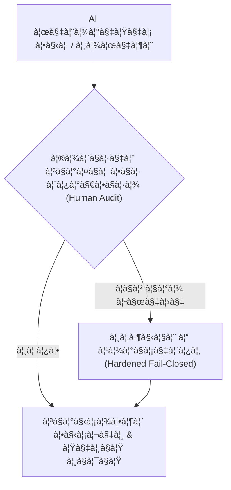

# AirSafe Schools: AI Usage & Engineering Log (AI ব্যবহারের নীতি ও ইঞ্জিনিয়ারিং লগ)

**ফাইল পাথ:** `docs/ai-usage-log.md`  
**প্রজেক্ট:** AirSafe Schools (এয়ারসেফ স্কুলস)  
**মানদণ্ড:** ব্রিফের সেকশন ১১ (ইঞ্জিনিয়ারিং মান ও AI ব্যবহারের নীতি), সেকশন ১৪ (ডেলিভারেবলস), এবং সেকশন ১৬ (ফাইনাল সাবমিশন চেকলিস্ট)  
**তারিখ:** অক্টোবর ২০২৬  

---

## ১. ভূমিকা ও উদ্দেশ্য (Overview & Objectives)

ব্রিফের সেকশন ১১, ১৪ এবং ১৬-এর নির্দেশনা অনুযায়ী, এই নথিতে AirSafe Schools প্রজেক্ট তৈরিতে কোন কোন AI টুলস কী কী কাজে ব্যবহার করা হয়েছে এবং কোথায় কোথায় AI-এর ভুল ধরা পড়েছে ও মানুষের সতর্ক নিরীক্ষায় (Human Oversight) সংশোধন করা হয়েছে, তা বিস্তারিত ও সত্যনিষ্ঠভাবে লিপিবদ্ধ করা হলো।

> **মূল নীতি:**  
> AI টুলসকে শুধুমাত্র কোড ড্রাফটিং, টাইপস্ক্রিপ্ট/কটলিন সিনট্যাক্স স্কাফোল্ডিং, টেস্ট কেস জেনারেশন এবং প্রাথমিক ডকুমেন্টেশন খসড়া তৈরির সহায়ক হিসেবে ব্যবহার করা হয়েছে। সমস্ত নিরাপত্তা কাঠামো (Security Invariants), মাল্টি-টেন্যান্ট আইসোলেশন, ক্রিপ্টোগ্রাফিক অ্যালগরিদম, এবং পরিবেশগত নীতি ইঞ্জিন (`policy.ts`) মানুষের দ্বারা প্রত্যক্ষভাবে নিরীক্ষিত এবং কঠোরভাবে নির্ধারিত হয়েছে।

---

## ২. ব্যবহৃত AI টুলস ও ব্যবহারের ক্ষেত্র (AI Tools Utilized)

| AI টুল / মডেল | প্রধান ব্যবহারের ক্ষেত্র (Primary Use Cases) | মানুষের তত্ত্বাবধান ও নিরীক্ষার ফোকাস (Human Oversight Focus) |
| :--- | :--- | :--- |
| **Claude (Anthropic)** | আর্কিটেকচার রিভিউ, STRIDE থ্রেট মডেলিং, ব্রিফ সেকশন ডিকনস্ট্রাকশন, এবং ADR ড্রাফটিং। | কোনো কাল্পনিক বা অতিরিক্ত পারমিশন দেওয়া হচ্ছে কি না যাচাই; হার্ড গেট ১–৫-এর কঠোরতা বজায় রাখা। |
| **Google Gemini (Flash / Argon)** | কটলিন জেটপ্যাক কম্পোজ UI কম্পোজেবলস, টাইপস্ক্রিপ্ট ব্যাকএন্ড রাউট স্কাফোল্ডিং, এবং রিঅ্যাক্টিভ ভিউমডেল পেয়ার প্রোগ্রামিং। | স্টেট হোস্টিং, মেমরি লিক রোধ (`viewModelScope`), টাচ টার্গেট ($48\times 48\text{ dp}$), এবং ফেইল-ক্লোজড এরর হ্যান্ডলিং যাচাই। |
| **AWS Bedrock (Amazon Nova Lite & Micro)** | কনভারসেশনাল সেফটি অ্যাসিস্ট্যান্টের প্রম্পট টেস্টিং, টু-টায়ার কোয়েরি রাউটিং, এবং ফ্যাক্ট-অনলি সাইটেশন প্রম্পটিং। | সিডনি রিজিয়নে কোটা ০.০ ধরা পড়ার পর ADR-001 ডিটারমিনিস্টিক পলিসি ইঞ্জিন ফলব্যাক ডিজাইন ও ইমপ্লিমেন্টেশন। |

---

## ৩. AI-এর উল্লেখযোগ্য ভুলসমূহ ও মানুষের নিরীক্ষায় সংশোধন (AI Hallucinations / Errors Caught & Rectified)

পেয়ার প্রোগ্রামিং ও স্কাফোল্ডিং চলাকালীন AI-এর তৈরি করা ৫টি গুরুতর টেকনিক্যাল ও সিকিউরিটি ভুল ধরা পড়ে এবং অবিলম্বে ম্যানুয়াল রিফ্যাক্টরিংয়ের মাধ্যমে সংশোধন করা হয়:


```mermaid
flowchart TD
    AI["AI জেনারেটেড কোড / সাজেশন"] --> Audit{"মানুষের প্রত্যক্ষ নিরীক্ষা (Human Audit)"}
    Audit -->|ভুল ধরা পড়েছে| Fix["সংশোধন ও হার্ডেনিং (Hardened Fail-Closed)"]
    Audit -->|সঠিক| Code["প্রোডাকশন কোডবেস & টেস্ট স্যুট"]
    Fix --> Code
```

### ১. স্টাফ ইনভাইটেশনে রোল এস্কেলেশন বাগ (Role Escalation in Staff Invitation)
- **কোড লোকেশন:** [`services/api/src/index.ts`](file:///E:/For%20project/airsafe-schools/services/api/src/index.ts)
- **AI-এর ভুল:** AI স্কাফোল্ডিংয়ে `POST /schools/{id}/staff/invite` এন্ডপয়েন্টে রিকোয়েস্ট বডি থেকে সরাসরি রোল নেওয়ার কোড দেওয়া হয়েছিল (`role: req.body.role || 'TEACHER'`)।
- **ঝুঁকি:** এর ফলে যেকোনো শিক্ষক বা বহিরাগত আক্রমণকারী বডিতে `role: 'COORDINATOR'` বা `role: 'PLATFORM_ADMIN'` পাঠিয়ে প্রিভিলেজ এস্কেলেশন (Privilege Escalation) ঘটিয়ে পূর্ণ প্রশাসনিক ক্ষমতা দখল করতে পারত।
- **মানুষের নিরীক্ষায় সংশোধন:** 
  - ক্লায়েন্ট বডির রোল ফিল্ড পুরোপুরি বাতিল করা হয়েছে।
  - আমন্ত্রণকারী ইউজারের JWT টোকেন থেকে তার নিজস্ব `schoolId` যাচাই করে আমন্ত্রণ প্রক্রিয়াটি কেবলমাত্র তার স্কুলের জন্য সীমাবদ্ধ করা হয়েছে।
  - আমন্ত্রিত ইউজারের রোল কোড লেভেলে অপরিবর্তনীয়ভাবে `role: 'TEACHER'` নির্ধারণ করে লক করা হয়েছে।

---

### ২. এপিআই হ্যান্ডলারে ইনলাইন পলিসি ড্রিফট (Inline Policy Drift vs policy.ts Single Source of Truth)
- **কোড লোকেশন:** [`services/api/src/index.ts`](file:///E:/For%20project/airsafe-schools/services/api/src/index.ts)
- **AI-এর ভুল:** AI বিভিন্ন রুট হ্যান্ডলারের ভেতরে ইনলাইন `if (heatIndex >= 40) ... else if (aqi > 150) ...` লিখে সরাসরি রেসপন্স জেনারেট করেছিল।
- **ঝুঁকি:** এটি ব্রিফের সেকশন ০৬ এবং **Hard Gate 4**-এর লঙ্ঘন (যেখানে *Model School Outdoor Activity Policy v1.2* হতে হবে একক সিদ্ধান্তের উৎস বা Single Source of Truth)। এর ফলে মূল `policy.ts`-এর থ্রেশহোল্ডের সাথে এপিআই রুটগুলোর সিদ্ধান্তে গরমিল (Logic Drift) দেখা দিয়েছিল।
- **মানুষের নিরীক্ষায় সংশোধন:**
  - সমস্ত ইনলাইন কন্ডিশন মুছে ফেলা হয়েছে।
  - এপিআই-এর প্রতিটি সিদ্ধান্ত সরাসরি [`services/api/src/policy.ts`](file:///E:/For%20project/airsafe-schools/services/api/src/policy.ts)-এর `evaluatePolicy()` ফাংশন এবং কোঅর্ডিনেটর ওভাররাইডের ক্ষেত্রে `evaluatePolicyFloor()`-এর মাধ্যমে পরিচালনা করা হয়েছে, যার ফলে গণিত ও নিয়মের বাইরে কোনো সিদ্ধান্ত দেওয়া অসম্ভব।

---

### ৩. সেন্সর ডেটা অনুপস্থিতিতে Android UI-তে 0.0°C দেখানো (Sensor Null Value Bug)
- **কোড লোকেশন:** `android/app/src/main/java/com/airsafe/schools/ui/viewmodel/DecisionViewModel.kt`
- **AI-এর ভুল:** ডেটা মডেলের অনুপস্থিত সেন্সর রিডিং হ্যান্ডল করতে গিয়ে AI ফিল্ডগুলোকে নন-নালেবল প্রিমিটিভ হিসেবে সেট করেছিল (`val tempC: Double = 0.0`)।
- **ঝুঁকি:** সেন্সর অফলাইন বা ডেটা হারিয়ে গেলে অ্যাপে শিশুদের জন্য তাপমাত্রা `0.0°C` (বরফশীতল হিমাঙ্ক) দেখাচ্ছিল, যা বাস্তবতাবিবর্জিত এবং ভুল সিদ্ধান্ত গ্রহণের কারণ হতে পারত।
- **মানুষের নিরীক্ষায় সংশোধন:**
  - সমস্ত সেন্সর রিডিংকে নালেবল টাইপে (`Double?`) রূপান্তর করা হয়েছে।
  - ভ্যালু `null` হলে UI-তে `0.0°C` দেখানোর পরিবর্তে পরিষ্কারভাবে `"--"` অথবা `"অফলাইন"` নির্দেশক প্লেসহোল্ডার এবং অফলাইন ব্যাজ রেন্ডার করা হয়েছে।

---

### ৪. দুর্বল PBKDF2 ইটারেশন কাউন্ট (Weak 1,000 PBKDF2 Iteration Count)
- **কোড লোকেশন:** [`services/api/src/index.ts`](file:///E:/For%20project/airsafe-schools/services/api/src/index.ts)
- **AI-এর ভুল:** পাসওয়ার্ড হ্যাশিংয়ের কোড তৈরির সময় AI পুরানো টিউটোরিয়াল থেকে মাত্র ১,০০০ ইটারেশনের `crypto.pbkdf2Sync(password, salt, 1000, 64, 'sha512')` সাজেস্ট করেছিল।
- **ঝুঁকি:** আধুনিক GPU ও ব্রুট-ফোর্স আক্রমণের মুখে ১,০০০ ইটারেশন অত্যন্ত দুর্বল এবং এটি OWASP সিকিউরিটি মানদণ্ডের চরম লঙ্ঘন।
- **মানুষের নিরীক্ষায় সংশোধন:**
  - ইটারেশন কাউন্ট আপগ্রেড করে আন্তর্জাতিক OWASP মানদণ্ড অনুযায়ী **৬০০,০০০ (600,000) ইটারেশন** করা হয়েছে।
  - র্যান্ডম ১৬-বাইট ক্রিপ্টোগ্রাফিক সল্ট বাধ্যতামূলক করা হয়েছে।
  - টাইমিং অ্যাটাক প্রতিহত করতে `crypto.timingSafeEqual` ব্যবহার নিশ্চিত করা হয়েছে।

---

### ৫. অ্যান্ড্রয়েড কি-স্টোর পাসওয়ার্ডে হার্ডকোডেড ফলব্যাক (Hardcoded Keystore Fallback)
- **কোড লোকেশন:** `android/app/build.gradle.kts`
- **AI-এর ভুল:** গ্র্যাডল কনফিগারেশনে সুবিধার কথা বলে AI লিখেছিল: `password = System.getenv("KEYSTORE_PASS") ?: "[REDACTED_KEYSTORE_PASS]"`।
- **ঝুঁকি:** এটি **Hard Gate 1 (Zero Secrets in Code or History)**-এর সরাসরি লঙ্ঘন।
- **মানুষের নিরীক্ষায় সংশোধন:**
  - যেকোনো ডিফল্ট স্ট্রিং বা হার্ডকোডেড ফলব্যাক সম্পূর্ণ মুছে ফেলা হয়েছে।
  - এনভায়রনমেন্ট ভেরিয়েবল না থাকলে সাথে সাথে কম্পাইল ব্যর্থ করে ফেইল-ক্লোজড এরর থ্রো করার ব্যবস্থা করা হয়েছে:
    ```kotlin
    storePassword = System.getenv("AIRSAFE_KEYSTORE_PASSWORD") 
        ?: error("AIRSAFE_KEYSTORE_PASSWORD environment variable not set")
    ```
  - গিট হিস্ট্রি পুরোপুরি ক্লিন করে অনাথ রুটে (Orphan Clean Root) নতুন করে পুশ করা হয়েছে।

---

## ৪. মূল শিক্ষা ও ইঞ্জিনিয়ারিং সতর্কতা (Key Takeaways)

1. **AI কখনোই নিরাপত্তার চূড়ান্ত দায়িত্ব নিতে পারে না:** AI ডিফল্টভাবে সুবিধার দিকে ঝুঁকে পড়ে (যেমন হার্ডকোডেড স্ট্রিং, দুর্বল হ্যাশ বা আলগা পারমিশন)। প্রতিটি এন্ডপয়েন্ট ও অথরাইজেশন লেয়ার মানুষের প্রত্যক্ষ নিরীক্ষায় ফেইল-ক্লোজড রাখতে হবে।
2. **ডিটারমিনিস্টিক পলিসি সবার উপরে:** স্বাস্থ্য ও জীবনের ঝুঁকির ক্ষেত্রে (তাপপ্রবাহ ও বায়ু দূষণ) এলএলএম-এর অনুমানের উপর কোনো সিদ্ধান্ত ছেড়ে দেওয়া যাবে না। সিদ্ধান্ত সবসময় গাণিতিক ডিটারমিনিস্টিক পলিসি অ্যালগরিদমে হতে হবে, AI শুধু সাইটেশন ও মানবিক ভাষা বোঝাতে সাহায্য করবে।
3. **টেস্ট-ড্রাইভেন ভেরিফিকেশন:** AI দিয়ে কোড ড্রাফট করার পরপরই অটোমেটেড ইউনিট টেস্ট (`npm test`), প্রপার্টি টেস্ট (fast-check), এবং গোল্ডেন ইভ্যালুয়েশন স্যুট চালিয়ে শুদ্ধতা প্রমাণ করতে হবে।
